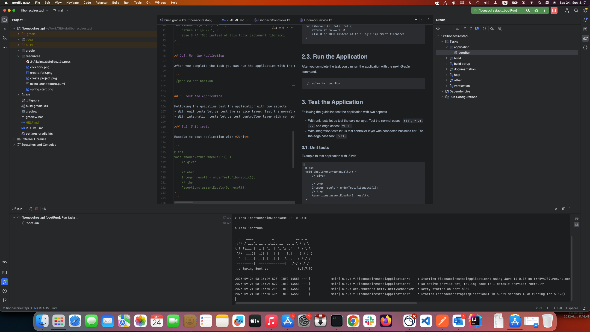

# Fibonacci Backend Service with Spring

This guide will walk you through creating a Fibonacci number application using Spring.

# What You Will Build

You will create a backend application that accepts HTTP GET requests at: http://localhost:8080/fibonacci?n=5.

The application will respond with a static page where the body contains the n-th Fibonacci number. If n is greater than 46, the application will return a BAD REQUEST (500) status code.

The Fibonacci numbers are calculated using the following expression:

```
f(n) = f(n - 1) + f(n - 2)
```

Specifically:
```
f(1) = 1
f(2) = 1
f(3) = 2
f(4) = 3
f(5) = 5
f(6) = 8
...
```

# What You Need

- A GitHub account. If you don’t have one, you can sign up here: https://github.com/signup.
- IntelliJ installed on your machine.

# Steps

Follow the steps below to build the Fibonacci application.

## 1. Fork the application

1. Log in to your GitHub account to fork this repository.
2. Click the “Fork” button at the top right of this page.


3. Choose the destination project within your GitHub account.


4. The application architecture is illustrated in the following diagram.


5. Start developing by following the instructions below. Happy coding!

## 2. Develop Fibonacci application

## 2.1. Run the Application

Once you’ve completed the code, you can run the application using the following Gradle command:

```
./gradlew.bat bootRun
```

Alternatively, you can start the application from the Gradle panel in IntelliJ.



### 2.2. Modify the Controller layer

In Spring’s web development approach, HTTP requests are handled by controllers. A controller is easily identified by the @RestController annotation. 

```
@GetMapping(value = ["fibonacci"])
open fun fibonacci(@RequestParam n: Int): Int? {
   // TODO - If n is greater than 46 then return BAD REQUEST use HttpStatus
   return fibonacciService?.fibonacci(n)
}
```

This controller is simple and concise, but there’s a lot happening. Let’s break it down step by step.

The `@GetMapping` annotation ensures that HTTP GET requests to */fibonacci* are mapped to
the `fibonacci()` method.

The `@RequestParam` binds the value of the query string parameter `n` into
the `n` parameter of the `fibonacci()` method. This query string parameter is 
`required`.

The controller layer invokes the service layer and returns the result of the Fibonacci calculation.

### 2.3. Modify Service Layer

The service layer is located in the service package. In Spring, the business logic is implemented in the service layer, annotated with `@Component` or `@Service`.

Implement the Fibonacci algorithm under the next code:

```
fun fibonacci(n: Int): Int {
    return if (n == 1) 0
    else 0 // TODO instead of this logic implement fibonacci
}
```

## 3. Test the Application

Follow the guidelines below to test the application from two perspectives:
- *Unit tests*: Test the service layer, including normal cases (`f(1)`, `f(2)`, ...) and edge cases (like `f(-1)`).
- *Integration tests*: Test the controller layer in conjunction with the service layer, including edge cases such as `f(47)`.

### 3.1. Unit tests

Here’s an example of how to write a unit test using *JUnit*:

```
@Test
void shouldReturn0WhenCall1() {
    // given

    // when
    Integer result = underTest.fibonacci(1);
    // then
    Assertions.assertEquals(0, result);
}
```

### 3.2. Integration tests

Here’s an example of how to test the controller layer with *JUnit*:

```
@Test
void callFibonacciEndpoint() {
    // given

    // when
    ResponseEntity<String> entity = restTemplate.getForEntity("http://localhost:8080/fibonacci?n=5", String.class);

    // then
    Assertions.assertEquals(HttpStatus.OK, entity.getStatusCode());
    Assertions.assertEquals("3", entity.getBody());
}
```

### 3.3. Manual test

Finally, open your browser and navigate to http://localhost:8080/fibonacci?n=10, where you should see “55”.
