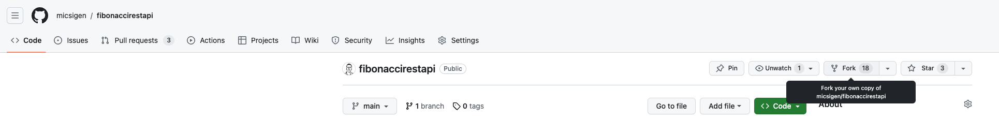
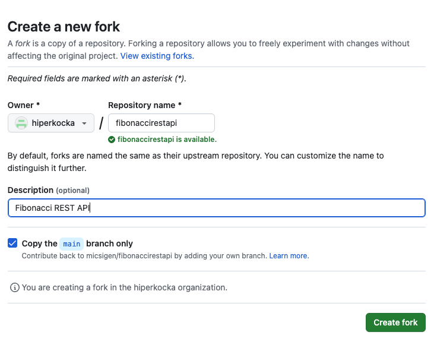

# Fibonacci backend service with Spring

This guide walks you through the process of creating a *Fibonacci* number application with Spring.

# What You Will Build

You will build an backend application that will accept HTTP GET requests at: `http://localhost:8080/fibonacci?n=5`.

It will respond a static page that body will contain a *n.* fibonacci number. If the *n* is greater than *46* then return *BAD REQUEST* (500) response code.

The Fibonacci number are represented with the next expression:

```
f(n) = f(n - 1) + f(n - 2)
```

Especially:
```
f(1) = 0
f(2) = 1
f(3) = 1
f(4) = 2
f(5) = 3
f(6) = 5
...
```

# What You Need

- Create a GitHub account if you do not have yet: https://github.com/signup
- Java RE Version 11: https://www.oracle.com/java/technologies/javase/jdk11-archive-downloads.html
- Gradle Version: https://gradle.org/releases/
- Visual Studio Code: https://code.visualstudio.com/download

# Steps

Next steps help to build the *Fibonacci* application.

## 1. Fork the application

1. Log in onto GitGub account to fork this application.
2. Click on fork button top left on this page.



3. Select destination project on your own.



4. Start the development to follow the next instructions. Happy coding!

## 2. Develop Fibonacci application

The layers are shown on the next diagram.


### 2.1. Modify the Controller layer

In Spring's approach to building web sites, HTTP requests are handled by a controller. You
can easily identify the controller by the `@RestController` annotation. 

```
@GetMapping(value = ["fibonacci"])
open fun fibonacci(@RequestParam n: Int): Int? {
   // TODO - If n is greater than 46 then return BAD REQUEST use HttpStatus
   return fibonacciService?.fibonacci(n)
}
```

This controller is concise and simple, but there is plenty going on. We break it down step
by step.

The `@GetMapping` annotation ensures that HTTP GET requests to */fibonacci* are mapped to
the `fibonacci()` method.

The `@RequestParam` binds the value of the query string parameter `n` into
the `n` parameter of the `fibonacci()` method. This query string parameter is 
`required`.

The point is that the controller layer call the service layer and return the business result of fibonacci calculation.

### 2.2. Modify Service Layer

Service layer are placed under service package. In Spring's approach to build business tier is used with `@Component` or `@Service` annotations. In business function should be implemented the above-mentioned Fibonacci number service, that return the n. Fibonacci number.

Implement the Fibonacci algorithm under the next code:

```
fun fibonacci(n: Int): Int {
    return if (n == 1) 0
    else 0 // TODO instead of this logic implement fibonacci
}
```

## 2.3. Run the Application

After you complete the task you can run the application with the next *Gradle* command.

```
./gradlew.bat bootRun
```

## 3. Test the Application

Following the guideline test the application with two aspects
- With unit tests let us test the service layer. Test the normal cases: `f(1), f(2), ...` and edge cases: `f(-1)`.
- With integration tests let us test controller layer with connected business tier. The the edge case too: `f(47)`.

### 3.1. Unit tests

Example to test application with *JUnit*:

```
@Test
void shouldReturn0WhenCall1() {
    // given

    // when
    Integer result = underTest.fibonacci(1);
    // then
    Assertions.assertEquals(0, result);
}
```

### 3.2. Integration tests

Example to test controller layer with *JUnit*

```
@Test
void callFibonacciEndpoint() {
    // given

    // when
    ResponseEntity<String> entity = restTemplate.getForEntity("http://localhost:8080/fibonacci?n=5", String.class);

    // then
    Assertions.assertEquals(HttpStatus.OK, entity.getStatusCode());
    Assertions.assertEquals("3", entity.getBody());
}
```

### 3.3. Manual test

Now that the web site is running, visit `http://localhost:8080/fibonacci?n=10`, where you should
see "55"
